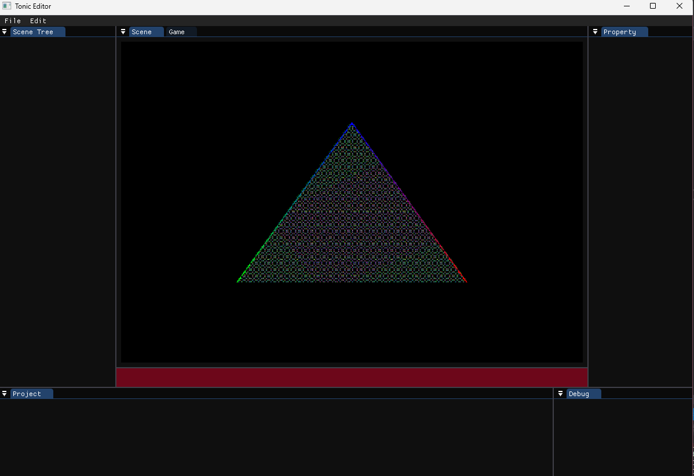
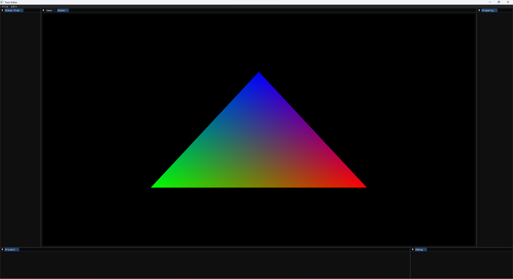
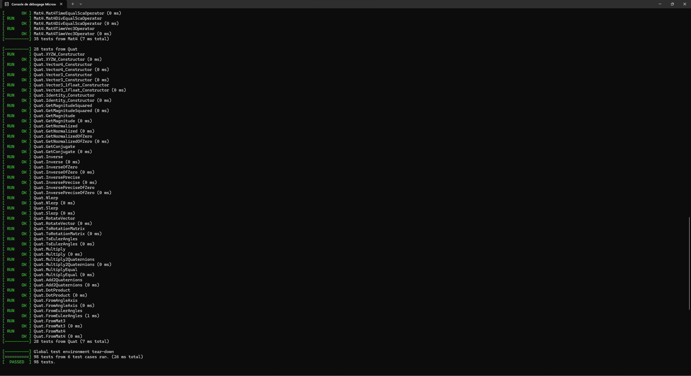

# Tonic Engine

## ⭐ About the Project
This project is a game Engine with an Editor written in  and compiled with MSVC 2019.

## 📚 External libraries
|Functionality	| Library |
|---------------|---------|
|Graphic API|<a href="https://www.opengl.org/">OpenGL</a>|
|Window|<a href="https://www.glfw.org/">GLFW</a>|
|3D Model Parser	|<a href="https://github.com/assimp/assimp">assimp</a>|
|Image Parser|<a href="https://github.com/nothings/stb/blob/master/stb_image.h">stb_image</a>|
|Sound|<a href="https://miniaud.io/">miniaudio</a>|
|Physics|<a href="https://github.com/NVIDIA-Omniverse/PhysX">Nvidia PhysX</a>|
|GUI (Editor)|<a href="https://github.com/ocornut/imgui">Dear ImGui</a>|
|Font|<a href="https://freetype.org/">FreeType</a>
|Reflection|<a href="https://github.com/jsoysouvanh/Refureku/">Refureku</a> or <a href="https://github.com/rttrorg/rttr/">rttr</a>|

## 📷 ScreenShots

## ✒ Authors
- <a href = "mailto: f.becaud@student.isartdigital.com">Félix BECAUD</a>
- <a href = "mailto: j.perrochaud@student.isartdigital.com">Jessica PERROCHAUD</a>
- <a href = "mailto: m.robion@student.isartdigital.com">Mathieu ROBION</a>
- <a href = "mailto: m.dero@student.isartdigital.com">Morgane DERO</a>
