# Tonic Engine

<a href="#">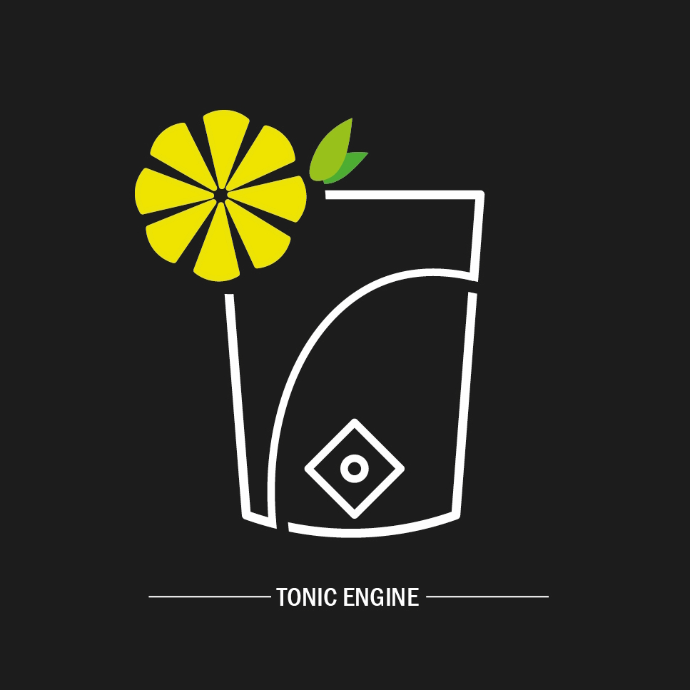</a>
## ⭐ About the Project
This project is a game Engine with an Editor written in  and compiled with MSVC 2019.

## 📑 Editor Feature

### Scene tree

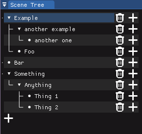

- It allows you to interact with the Entities

### Property:

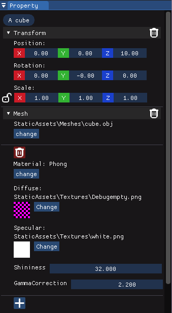

- It allows you to edit the components of an entity

### Project viewer:

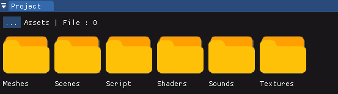

- It allows you to view and interact with the project files and creating new files and folders.

### Debug Panel:

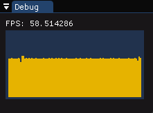

- It shows debug information in the editor. for now it only shows the FPS.

### Menu Bar:

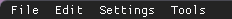

- The menu bar allows you to open the project and save it. It also allows you to quit the application and use some aditional features.
    
    ### aditional features :
        
    #### Settings

    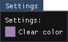

    - It allow you to change the settings of the application.

    #### Tools

    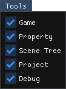

    - It allow you to open the tools to help you develop your game.

## 📚 External libraries
|Functionality	| Library |
|---------------|---------|
|Graphic API|<a href="https://www.opengl.org/">OpenGL</a>|
|Window|<a href="https://www.glfw.org/">GLFW</a>|
|3D Model Parser	|<a href="https://github.com/assimp/assimp">assimp</a>|
|Image Parser|<a href="https://github.com/nothings/stb/blob/master/stb_image.h">stb_image</a>|
|Sound|<a href="https://miniaud.io/">miniaudio</a>|
|Physics|<a href="https://github.com/jrouwe/JoltPhysics">Jolt</a>|
|GUI (Editor)|<a href="https://github.com/ocornut/imgui">Dear ImGui</a>|
|Font|<a href="https://freetype.org/">FreeType</a>

## 📷 ScreenShots

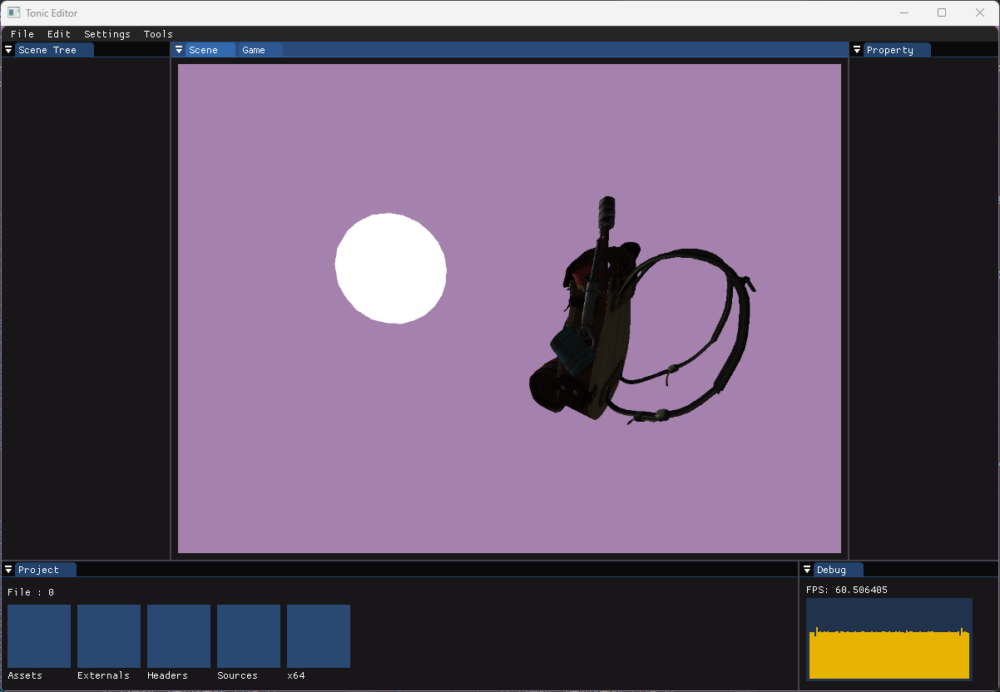
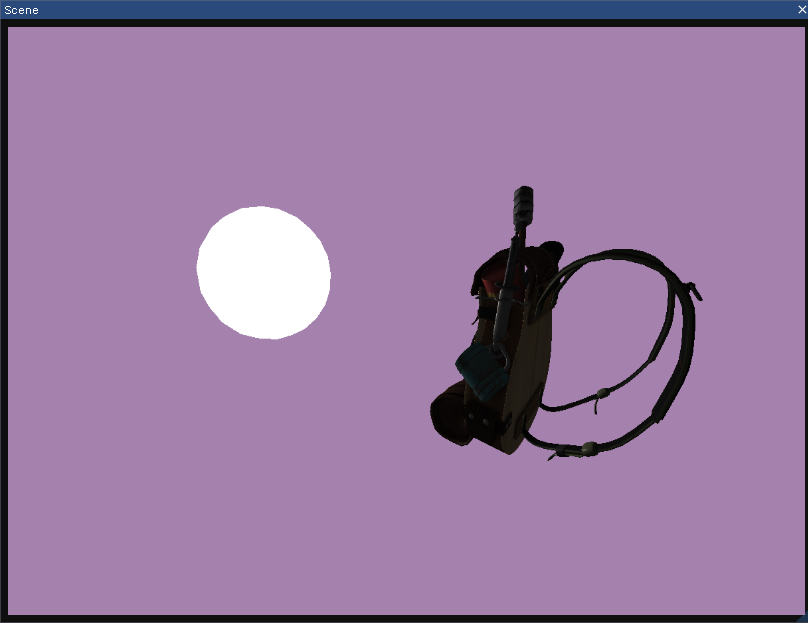
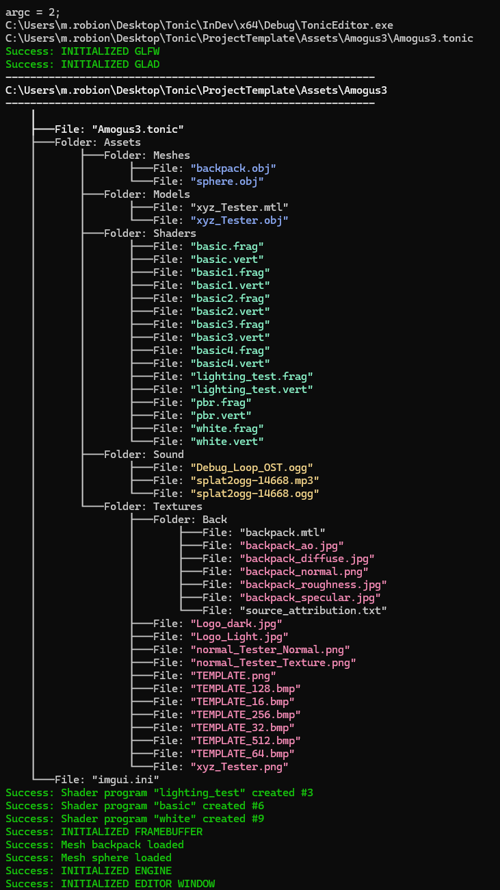
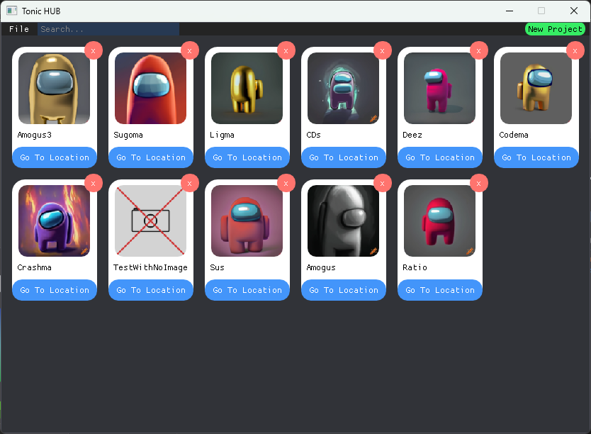

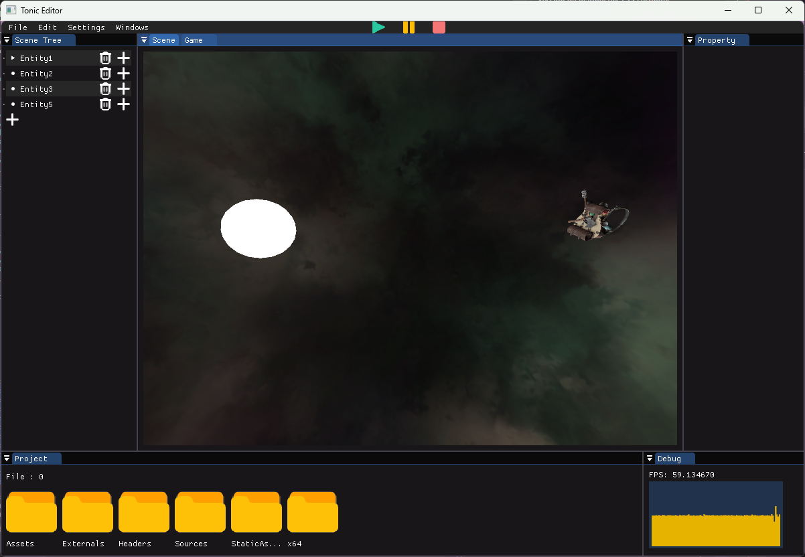
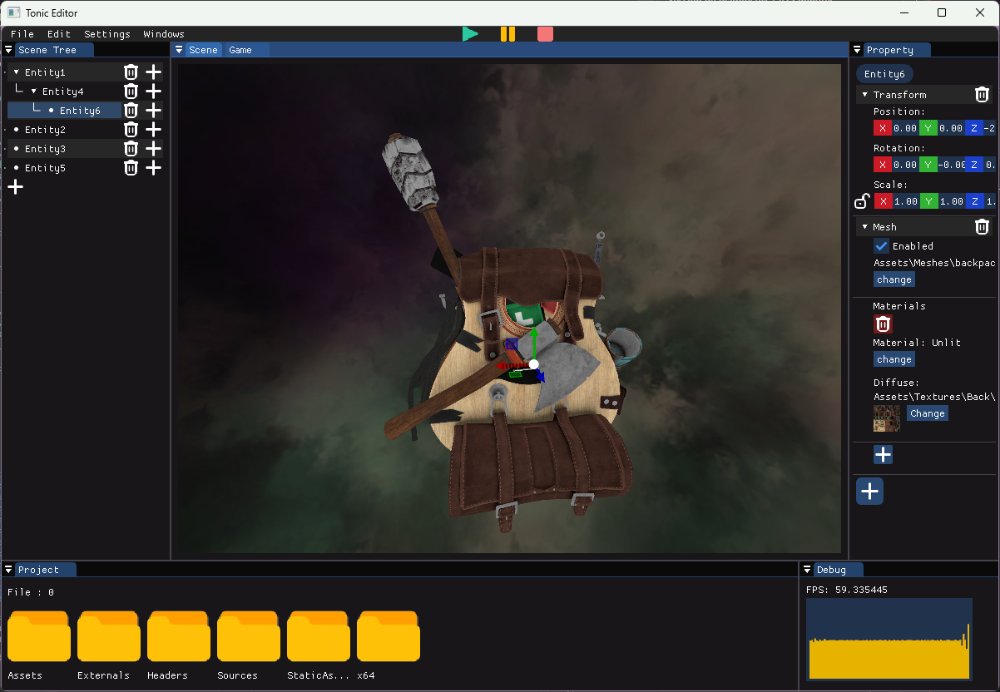
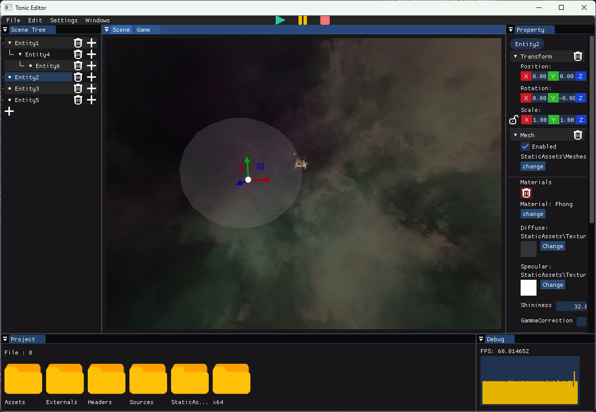

## ✒ Authors
- <a href = "mailto: f.becaud@student.isartdigital.com">Félix BECAUD</a>
- <a href = "mailto: j.perrochaud@student.isartdigital.com">Jessica PERROCHAUD</a>
- <a href = "mailto: m.robion@student.isartdigital.com">Mathieu ROBION</a>
- <a href = "mailto: m.dero@student.isartdigital.com">Morgane DERO</a>
